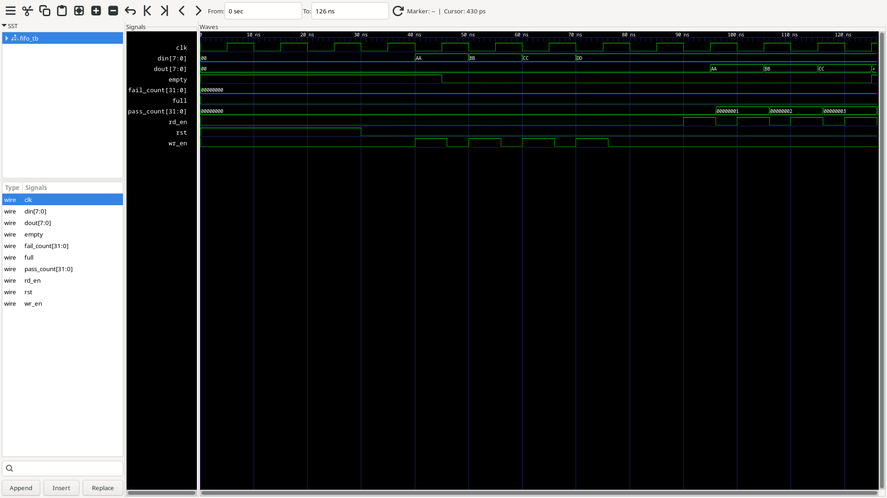

# Synchronous FIFO with Functional Verification

A fully verified 8-deep, 8-bit Synchronous FIFO (First In First Out) buffer designed in SystemVerilog, with a self-checking testbench covering ordering, full flag, and empty flag behavior.

---

## Description

A Synchronous FIFO is a memory buffer where data is written and read using the same clock. It follows the First In First Out principle — the first data written is the first data read out.

FIFOs are used whenever two components run at different speeds or different clock frequencies — the FIFO sits between them as a buffer, smoothing out the speed difference.

Each clock pulse advances the write or read pointer by one slot. The FIFO has two key flags — Full and Empty — that prevent overflow and underflow.

---

## FIFO States

| State | Condition | Behavior |
|-------|-----------|----------|
| EMPTY | count = 0, WR = RD | Reading not allowed |
| OK | 0 < count < 8 | Both read and write allowed |
| FULL | count = 8 | Writing not allowed |

---

## Port Description

| Port | Direction | Width | Description |
|------|-----------|-------|--------------|
| `clk` | input | 1-bit | Clock |
| `rst` | input | 1-bit | Reset (active high) |
| `wr_en` | input | 1-bit | Write enable |
| `rd_en` | input | 1-bit | Read enable |
| `din` | input | 8-bit | Data input |
| `dout` | output | 8-bit | Data output |
| `full` | output | 1-bit | Full flag |
| `empty` | output | 1-bit | Empty flag |

---

## Project Structure

```
synchronous-fifo-verification/
├── rtl/
│   └── fifo.sv              # FIFO RTL design
├── tb/
│   └── fifo_tb.sv           # SystemVerilog testbench
├── sim/
│   └── waveform.vcd         # GTKWave dump
├── synth/
│   └── synth.ys             # Yosys synthesis script
├── docs/
│   └── waveforms/           # GTKWave screenshots and schematic
└── README.md
```

---

## Tools Used

| Tool | Purpose |
|------|---------|
| SystemVerilog | RTL Design & Testbench |
| Verilator | Simulation |
| GTKWave | Waveform Viewer |
| Yosys | Logic Synthesis |

---

## How to Run

### Simulate with Verilator

```bash
verilator --binary --trace -sv rtl/fifo.sv tb/fifo_tb.sv --top-module fifo_tb
./obj_dir/Vfifo_tb
```

### View Waveforms

```bash
gtkwave sim/waveform.vcd
```

### Synthesize with Yosys

```bash
yosys synth/synth.ys
```

---

## Verification Plan

- **Basic order test** — write AA, BB, CC, DD and confirm they read back in the same order (FIFO property)
- **Full flag test** — fill all 8 slots and confirm `full` asserts correctly
- **Empty flag test** — drain all 8 slots and confirm `empty` asserts correctly
- **Self-checking** — testbench tasks (`write_fifo`, `write_only`, `read_check`) automatically compare expected vs actual data

## Sample Waveform


## Gate-level Schematic

---

## Results

| Metric | Result |
|--------|--------|
| Basic order tests | ✅ 4 / 4 Passing |
| Full flag test | ✅ Passing |
| Empty flag test (8 reads) | ✅ 9 / 9 Passing |
| Total tests | ✅ 14 / 14 Passing |
| Synthesis | ✅ 246 cells, 0 problems |
| Flip-flops used | 82 (`$_DFFE_`, `$_SDFFE_`) |

---

## What I Learned

- Sequential RTL design using `always_ff` and `always_comb`
- Registered vs combinational outputs and why timing matters
- Synchronous testbench design — driving inputs at `negedge`, sampling outputs after `posedge` + settle delay
- Writing reusable testbench tasks (`write_fifo`, `write_only`, `read_check`)
- Debugging real timing bugs using GTKWave and hierarchical signal probing (`uut.count`, `uut.wr_ptr`)
- Distinguishing genuine RTL bugs from stale build artifacts during debugging
- Gate-level synthesis flow using Yosys for a sequential design

---

## Academic Context

**Course:** BE.EE (VLSI Design and Technology)
**Institution:** Anna University Regional Campus Coimbatore
**Tools:** Open-source EDA (Yosys, Verilator, GTKWave)

---

## License

MIT License — feel free to fork and build on this!
